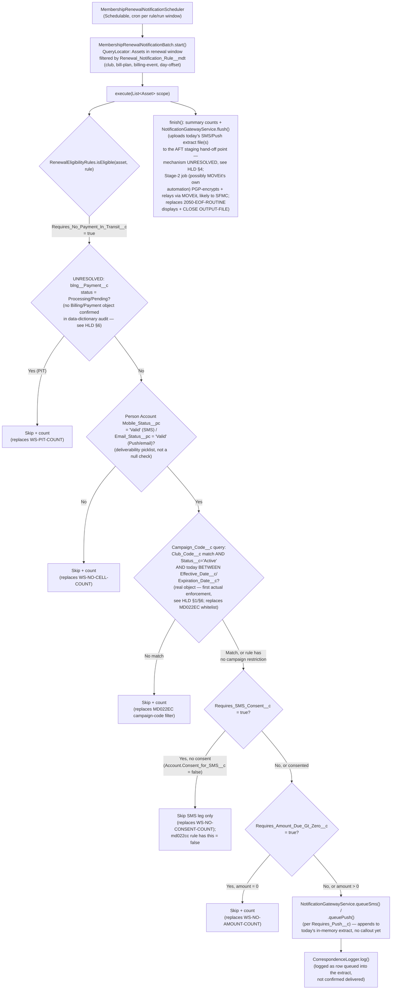
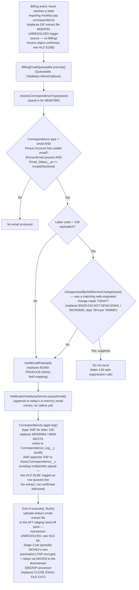

# Revenue Cloud Workflow Diagrams

Companion to `docs/salesforce-design/high-level-design.md`. Each diagram
maps a legacy COBOL batch flow onto its proposed Salesforce/Revenue Cloud
equivalent. See that document's Apex Class Inventory (§5) and Explicit
Flags (§6) for the assumptions each diagram relies on, and see
`docs/salesforce-design/data-dictionary-reference.md` for the real,
field-verified schema these diagrams now reflect — members are **Person
Accounts** (not a separate `Contact`), and any `blng__` step below is a
still-unresolved placeholder (no Billing/Payment object was found in the
org audit), not a confirmed field.

**Every `flush()` step below** ("uploads to MOVEit") is corrected per
`docs/salesforce-design/moveit-aft-reference.md`, the real Control-M/AFT
job configuration: MOVEit is not necessarily the final destination — the
real pipeline is two stages, chained by job predecessor, and the evidence
(PGP key named `salesforce-prod-042325-1 (sfmc xfer)`, SFMC
MobileConnect-specific column names `SubscriberKey`/`Locale` in the real
SMS extract) strongly indicates **Salesforce Marketing Cloud is the real
final consumer** past MOVEit. A plaintext file lands in a staging drop
point (Stage 1), then a separate "Encrypted File Transfer Job" (Stage 2)
PGP-encrypts it and delivers it to MOVEit. **MOVEit itself is confirmed
capable of PGP encryption (user-confirmed 2026-09-01)**, so Stage 2 may
well be MOVEit's own automation engine running that encryption task
directly, rather than a separate non-MOVEit system chained in front of it
— meaning Apex uploading a plaintext file straight to a MOVEit-exposed
HTTPS endpoint, with MOVEit itself applying the PGP encryption, is now the
leading candidate for `flush()`'s hand-off mechanism. `flush()`'s exact
endpoint/API shape, auth, and whether a new MOVEit task/folder needs
provisioning remain an **open question** (Apex can only make outbound
HTTPS callouts; it cannot write to the AFT pipeline's local staging file
share directly) — see `high-level-design.md` §4 and
`moveit-aft-reference.md` before assuming any specific endpoint shape.

## 1. Renewal SMS/Push Eligibility Batch

Replaces `MD021EX` + the `MD022*` family (`MD022EX`, `MD022ER`, `MD022EC`,
`MD022LP`, `md022cc`). A single scheduled, config-driven batch replaces six
separate COBOL programs by loading the applicable `Renewal_Notification_Rule__mdt`
record(s) per run instead of hard-coding one program per variant.



**Caption**: The legacy programs differ mainly in *which* gates apply and
in what order (see `high-level-design.md` §3 table) — not in the overall
shape of the flow. Pushing those differences into
`Renewal_Notification_Rule__mdt` lets one batch class serve all six
programs. `MD022ZA` is excluded from this diagram (see HLD §5/§6) because
its eligibility logic lived entirely in an out-of-scope upstream job. The
payment-in-transit gate (node `E`) remains genuinely unresolved — see HLD
§1/§6 "Billing/Payment gap" — while the phone/email deliverability gate
(node `F`) and the campaign-code gate (node `CAMP`) are corrected to real,
confirmed org fields/objects, not placeholders.

## 2. Billing Email Flow (MD134ML)



**Caption**: The letter-139 web-self-service suppression rule
(`INC943560`) is preserved as an explicit gate rather than dropped —
it is the one clearly business-critical special case in `MD134ML`.
Per the source doc's ambiguity note, the legacy program only logs
correspondence history for letter 139, not "all email correspondence" as
its own 2025 change ticket (MEM-481279) claimed; this diagram reflects
the code's *actual* behavior (log only 139-equivalent), and that
discrepancy should be resolved with the business before deciding whether
Revenue Cloud should log all billing emails or only the 139-equivalent
subset.

## 3. Card-Decline / Dunning Flow (MD572EM)

```mermaid
sequenceDiagram
    participant PG as Payment Gateway / Finance
    participant PE as Card_Decline_Event__e (Platform Event)
    participant H as CardDeclineDunningHandler (Queueable)
    participant EL as RenewalEligibilityRules /\nhelper methods
    participant NG as NotificationGatewayService
    participant CL as CorrespondenceLogger

    PG->>PE: Publish decline event\n(replaces Finance populating\nEMS_WORK_CCREJ)
    PE->>H: Platform Event trigger enqueues\nCardDeclineDunningHandler
    H->>EL: getClubRules(clubCode)\n(replaces MD699BR — club name/\nbilling-rules lookup; clubCode now sourced\nfrom Asset.Club__c, the working formula field —\nnot the broken Asset.CLUB_CODE__c, see HLD §6)
    H->>EL: getCurrentTermExpiration(asset)\n(replaces MD380MA; sourced from\nAsset.CurrentLifecycleEndDate — exact legacy\nsemantic match UNCONFIRMED, see HLD §6)
    H->>EL: getYearsOfService(asset)\n(replaces MD642BR — AAA join year)
    H->>EL: getAmountDue(billingAccount)\n(UNRESOLVED — replaces MD610BR; no\nBilling/Payment object confirmed in\ndata-dictionary audit, see HLD §1/§6)
    alt amount due = 0
        H->>CL: log(status=Suppressed, reason=AlreadyPaid)\n(replaces "paid" bucket delete\nfrom EMS_WORK_CCREJ)
    else bill plan still AC and unpaid
        H->>CL: log(status=Skipped, reason=RetryNextRun)\n(replaces row left on work table)
    else eligible
        H->>EL: getMembershipNumber(asset)\n(RESOLVED — Asset.Member_Number__c,\nalready populated by RVNMembershipNo\nApex/Generate_Membership_Number flow;\n53% blank data-quality gap, not an\nalgorithm gap — see HLD §1/§6)
        H->>EL: getUsableEmail(personAccount)\n(replaces MC501BCD; uses PersonEmail +\nEmail_Status__pc = 'Valid' on the Person\nAccount, not a separate Contact)
        alt no usable email
            H->>CL: log(status=Skipped, reason=NoEmail)
        else usable email
            H->>NG: queueEmail(declineTemplate, mergeFields)\n(appends to today's in-memory email\nextract — replaces MD572-OUTPUT\nrecord write to MD572O1; no callout yet)
            NG-->>H: queued
            H->>CL: log(status=Sent, type=CardDecline)\n(writes to Correspondence_Log__c AND\nAsset.Correspondence__c; row queued into\nthe extract, not confirmed delivered)
        end
    end
    H->>NG: flush()\n(end of execute(): uploads today's email\nextract file to the AFT staging hand-off\npoint — mechanism UNRESOLVED, see HLD §4;\nStage-2 job (possibly MOVEit's own\nautomation) PGP-encrypts + relays via MOVEit to the downstream\nEBIZ/EIP processor;\nreplaces CLOSE EMAIL-FILE-OUT)
    NG-->>H: upload result
    Note over H,CL: getProcessingDate() (replaces MD930BR)\nis called once at handler start,\nnot shown per-branch above for brevity.
```

**Caption**: `MD572EM`'s work-table-draining loop (fetch row, delete row,
commit) has no direct Apex equivalent — Platform Events are consumed
once and are not "left in a queue to retry" the way a DB2 work-table row
can be. The "skip and retry next run" branch (member still on autopay,
still unpaid) is modeled here as a logged, no-op outcome; if true
multi-day retry semantics are required, the recommended pattern is a
scheduled batch re-query of whatever the org's confirmed payment/decline
status source turns out to be (still an open question — see HLD §1/§6
"Billing/Payment gap") after N days, rather than relying on Platform Event
redelivery.

## 4. EFT Reject / Bill-Plan Reconciliation Flow (MD058CB)

```mermaid
flowchart TD
    A["EFT middleware: card-auto-update reject\n(replaces CAUCCREJ file)"] --> B["Insert Eft_Cau_Reject__c\n(Processed__c = false)"]
    B --> C["EftReconciliationBatch.start()\nQueryLocator: Eft_Cau_Reject__c\nWHERE Processed__c = false"]
    C --> D["execute(List&lt;Eft_Cau_Reject__c&gt; scope)"]
    D --> E["Resolve Asset for club + membership\nnumber (replaces 1600-CALL-MD380MA);\nAsset.Club__c (working formula field,\nNOT the broken Asset.CLUB_CODE__c),\nAsset.Bill_Plan__c (real formula) —\nsee HLD §6"]
    E --> F{"Current bill plan\nstill AC (autopay)?\n(replaces 8200-CHECK-BILLPLAN-AC;\nAsset.Bill_Plan__c = 'AC')"}
    F -->|"No — bill plan changed\nsince the reject was generated"| G["Write out-of-sync Correspondence_Log__c\nrecord (replaces 2100-WRITE-SYNC-FILE /\nEMS_WORK_CAU insert, job MD58SYNC)"]
    F -->|"Yes, still AC"| H{"Next billing-cycle bill plan\nstill AC?\n(replaces 8500-CHECK-BILLPLN-NXTEVT;\nUNRESOLVED — no confirmed 'next cycle\nbill plan' field exists on Asset, see HLD §6)"}
    H -->|"No"| G
    H -->|"Yes"| I{"Account.Out_Of_Territory__c = true?\n(replaces 8600-GET-LODGE-TYPE /\nMC501BCD lodge codes 1/3/4/6 —\nreal confirmed field replaces the\nguessed lodge-code equivalent)"}
    I -->|"Yes"| J["Write out-of-territory Correspondence_Log__c\nrecord (replaces 2300-WRITE-TERR-FILE,\njob MD58TERR)"]
    I -->|"No"| K{"Days to expiration &le; 23?\n(replaces 8250-CHECK-NBR-DAYS-EXPIRE,\nUT020DT, MEM-481325; sourced from\nAsset.CurrentLifecycleEndDate —\nexact legacy match UNCONFIRMED, see HLD §6)"}
    K -->|"Yes"| L["Suppress printed-letter equivalent\nbut still allow digital notifications\n(DO-NOT-PRINT)"]
    K -->|"No"| M["Digital notifications proceed\nnormally (DO-PRINT)"]
    L --> N["NotificationGatewayService.queueSms()/\n.queuePush()/.queueEmail()\nper channel — appends to today's\nin-memory extract, no callout yet\n(replaces 1900-CREATE-OUTPUT-FILES,\nMEM-480905); destinations sourced from\nPersonMobilePhone/PersonEmail on the\nPerson Account, gated by\nMobile_Status__pc/Email_Status__pc"]
    M --> N
    N --> O["CorrespondenceLogger.log()\nper channel: types 768/868/668\n(replaces 1970-UPDATE-CORR-HIST /\nMD300MA, MEM-481283; writes to\nCorrespondence_Log__c AND appends the\ncode to Asset.Correspondence__c —\nsee HLD §1/§6; logged as row\nqueued into the extract, not\nconfirmed delivered)"]
    O --> P["Mark Eft_Cau_Reject__c.Processed__c = true"]
    G --> P
    J --> P
    P --> Q["finish(): NotificationGatewayService.flush()\nuploads today's SMS/Push/Email extract\nfile(s) to the AFT staging hand-off point —\nmechanism UNRESOLVED, see HLD §4;\nStage-2 job (possibly MOVEit's own\nautomation) PGP-encrypts + relays via MOVEit to the downstream\ngateway(s), likely SFMC\n(replaces CLOSE OUTSMS/OUTPSH/OUTEML)"]
```



**Caption**: The historical "flip household bill plan back to AM and
queue a printed letter" branch (`2210-CHANGE-HOUSEHOLD-AM`,
`2220-UPDATE-NEXT-EVENT`, `2230-WRITE-MEMBER-SUMMARY`) is intentionally
**omitted** from this flow, matching its dormant/disabled state in the
current production source (MEM-480905) — see HLD §6. `MD058CB`'s
mainframe checkpoint/restart and `GO TO`-based deadlock retry loop are
replaced by Batch Apex's native per-scope transaction boundary and the
job's natural re-runnability over `Eft_Cau_Reject__c` rows still marked
`Processed__c = false`; this is a deliberate semantic change (see HLD §6)
and should be validated against actual at-least-once/exactly-once
processing requirements.
