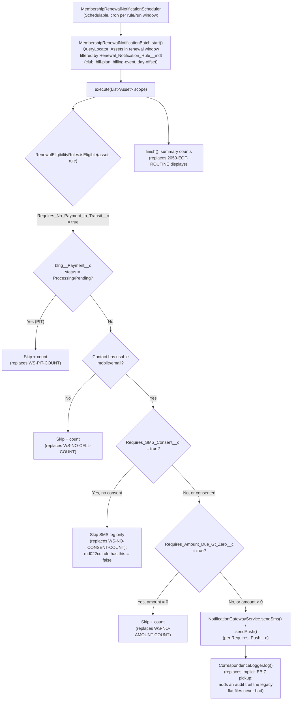
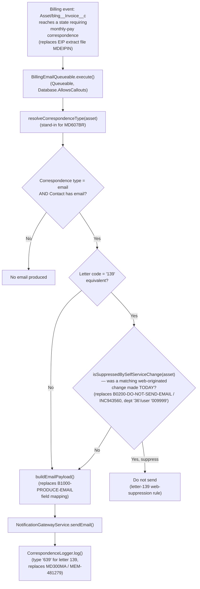
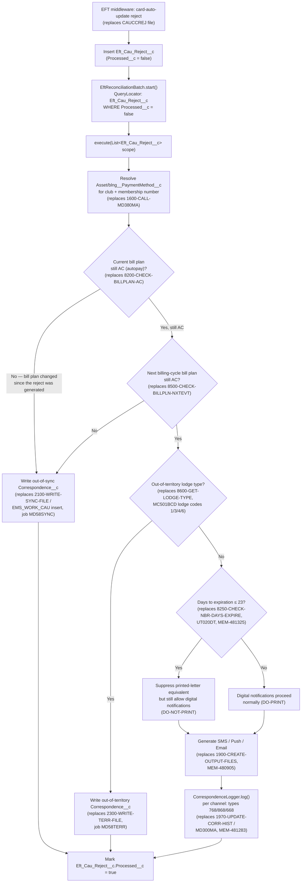

# Revenue Cloud Workflow Diagrams

Companion to `docs/salesforce-design/high-level-design.md`. Each diagram
maps a legacy COBOL batch flow onto its proposed Salesforce/Revenue Cloud
equivalent. See that document's Apex Class Inventory (§5) and Explicit
Flags (§6) for the assumptions each diagram relies on.

## 1. Renewal SMS/Push Eligibility Batch

Replaces `MD021EX` + the `MD022*` family (`MD022EX`, `MD022ER`, `MD022EC`,
`MD022LP`, `md022cc`). A single scheduled, config-driven batch replaces six
separate COBOL programs by loading the applicable `Renewal_Notification_Rule__mdt`
record(s) per run instead of hard-coding one program per variant.



**Caption**: The legacy programs differ mainly in *which* gates apply and
in what order (see `high-level-design.md` §3 table) — not in the overall
shape of the flow. Pushing those differences into
`Renewal_Notification_Rule__mdt` lets one batch class serve all six
programs. `MD022ZA` is excluded from this diagram (see HLD §5/§6) because
its eligibility logic lived entirely in an out-of-scope upstream job.

## 2. Billing Email Flow (MD134ML)



**Caption**: The letter-139 web-self-service suppression rule
(`INC943560`) is preserved as an explicit gate rather than dropped —
it is the one clearly business-critical special case in `MD134ML`.
Per the source doc's ambiguity note, the legacy program only logs
correspondence history for letter 139, not "all email correspondence" as
its own 2025 change ticket (MEM-481279) claimed; this diagram reflects
the code's *actual* behavior (log only 139-equivalent), and that
discrepancy should be resolved with the business before deciding whether
Revenue Cloud should log all billing emails or only the 139-equivalent
subset.

## 3. Card-Decline / Dunning Flow (MD572EM)

```mermaid
sequenceDiagram
    participant PG as Payment Gateway / Finance
    participant PE as Card_Decline_Event__e (Platform Event)
    participant H as CardDeclineDunningHandler (Queueable)
    participant EL as RenewalEligibilityRules /\nhelper methods
    participant NG as NotificationGatewayService
    participant CL as CorrespondenceLogger

    PG->>PE: Publish decline event\n(replaces Finance populating\nEMS_WORK_CCREJ)
    PE->>H: Platform Event trigger enqueues\nCardDeclineDunningHandler
    H->>EL: getClubRules(clubCode)\n(replaces MD699BR — club name/\nbilling-rules lookup)
    H->>EL: getCurrentTermExpiration(asset)\n(replaces MD380MA)
    H->>EL: getYearsOfService(asset)\n(replaces MD642BR — AAA join year)
    H->>EL: getAmountDue(billingAccount)\n(replaces MD610BR)
    alt amount due = 0
        H->>CL: log(status=Suppressed, reason=AlreadyPaid)\n(replaces "paid" bucket delete\nfrom EMS_WORK_CCREJ)
    else bill plan still AC and unpaid
        H->>CL: log(status=Skipped, reason=RetryNextRun)\n(replaces row left on work table)
    else eligible
        H->>EL: getMembershipNumber(asset)\n(replaces MD999CK)
        H->>EL: getContactAndEmail(contact)\n(replaces MC501BCD;\nrequires valid-code '1' or '3' equivalent)
        alt no usable email
            H->>CL: log(status=Skipped, reason=NoEmail)
        else usable email
            H->>NG: sendEmail(declineTemplate, mergeFields)\n(replaces MD572-OUTPUT record write\nto MD572O1)
            NG-->>H: callout result
            H->>CL: log(status=Sent, type=CardDecline)
        end
    end
    Note over H,CL: getProcessingDate() (replaces MD930BR)\nis called once at handler start,\nnot shown per-branch above for brevity.
```

**Caption**: `MD572EM`'s work-table-draining loop (fetch row, delete row,
commit) has no direct Apex equivalent — Platform Events are consumed
once and are not "left in a queue to retry" the way a DB2 work-table row
can be. The "skip and retry next run" branch (member still on autopay,
still unpaid) is modeled here as a logged, no-op outcome; if true
multi-day retry semantics are required, the recommended pattern is a
scheduled batch re-query of `blng__Payment__c` records still in Declined
status after N days, rather than relying on Platform Event redelivery.

## 4. EFT Reject / Bill-Plan Reconciliation Flow (MD058CB)



**Caption**: The historical "flip household bill plan back to AM and
queue a printed letter" branch (`2210-CHANGE-HOUSEHOLD-AM`,
`2220-UPDATE-NEXT-EVENT`, `2230-WRITE-MEMBER-SUMMARY`) is intentionally
**omitted** from this flow, matching its dormant/disabled state in the
current production source (MEM-480905) — see HLD §6. `MD058CB`'s
mainframe checkpoint/restart and `GO TO`-based deadlock retry loop are
replaced by Batch Apex's native per-scope transaction boundary and the
job's natural re-runnability over `Eft_Cau_Reject__c` rows still marked
`Processed__c = false`; this is a deliberate semantic change (see HLD §6)
and should be validated against actual at-least-once/exactly-once
processing requirements.
